# RideFlow 🚖 | Real-time Ride Sharing Platform

**RideFlow** is a modern, scalable ride-sharing application built to demonstrate advanced real-time geospatial capabilities. It features a high-performance **FastAPI** backend and a cross-platform **Flutter** mobile app for both Riders and Drivers.

---

## 🚀 Key Features

- **Real-time Location Tracking**: Monitors driver locations with sub-second latency using **Redis Geo** and **WebSockets**.
- **Geospatial Dispatching**: Automatically matches riders with the nearest available driver within a 5km radius.
- **Dual-Role Mobile App**: Single codebase supporting both "Rider" and "Driver" modes with role-based UI switching.
- **Secure Authentication**: JWT-based auth flow (OAuth2 password bearer).
- **Scalable Architecture**: Docker-containerized backend with a Clean Architecture pattern.

## 🛠️ Tech Stack

### 📱 Mobile (Frontend)

- **Framework**: Flutter (Dart)
- **State Management**: Riverpod
- **Networking**: Dio (with Interceptors)
- **Maps**: OpenStreetMap (via `flutter_map`)

### 🚄 Backend (API)

- **Framework**: FastAPI (Python 3.11)
- **Database**: PostgreSQL + PostGIS (via SQLModel)
- **Caching & Pub/Sub**: Redis (for Geo tracking)
- **Deployment**: Docker & Docker Compose

---

## 🏗️ Architecture

```mermaid
graph TD
    Rider[📱 Rider App] <-->|WebSocket| WS[WebSocket Manager]
    Driver[🚗 Driver App] <-->|WebSocket| WS
    WS <--> Redis[(⚡ Redis Geo)]
    WS <--> API[🚀 FastAPI Routers]
    API <--> Postgres[(🐘 PostgreSQL + PostGIS)]
```



## 📦 Installation & Setup

### Prerequisites

- Docker Desktop
- Flutter SDK (3.x)

### 1. Start the Backend

The backend infrastructure is fully containerized.

```bash
docker compose up -d
```

_This will spin up the API (port 8000), Postgres (5432), and Redis (6379)._

### 2. Run the Mobile App

Connect your Android Emulator or iOS Simulator.

```bash
cd mobile
flutter pub get
flutter run
```

---

## 🧪 Testing

### Verification Scripts

We have included Python scripts to test the backend logic without the mobile app:

- **Auth Flow**: `python scripts/test_auth.py` (Registers and Logs in a user)
- **Ride Request**: `python scripts/test_trips.py` (Simulates a ride request payload)

---

## 🔮 Future Roadmap

- [ ] Integration with Stripe for payments.
- [ ] "Trip in Progress" state machine synchronization.
- [ ] Push notifications via Firebase.

---

_Built with ❤️ by IbroCalculus_
